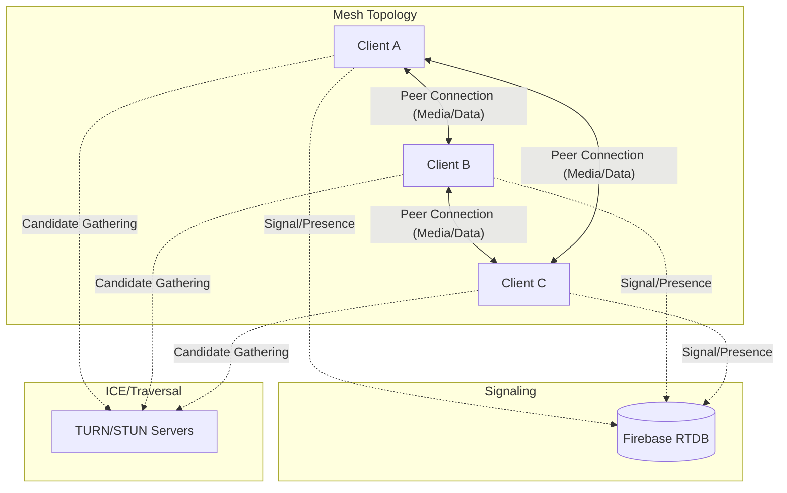

# Vayuroom Architecture & System Design

## 1. High-Level Overview

**Vayuroom** is a secure, ephemeral video conferencing application designed for privacy and ease of use. It operates on a **Mesh topology** using **WebRTC** for peer-to-peer media streaming, with **Firebase Realtime Database** serving as the signaling server. The application is built with **React** (Vite) and emphasizes end-to-end encryption.

### Core Principles
-   **Ephemeral**: No persistent user accounts or room history. Rooms exist only while users are present.
-   **Secure**: End-to-end encryption for chat and signaling metadata using PBKDF2 derived keys.
-   **Peer-to-Peer**: Direct media transfer between clients (Mesh), minimizing server costs and latency for small groups (Max 3 peers).

---

## 2. Technology Stack

### Frontend
-   **Framework**: React 19 + TypeScript (Vite)
-   **State Management**: Zustand
-   **Styling**: Vanilla CSS (Variables, Flexbox/Grid)
-   **Icons**: Lucide React

### Backend / Infrastructure
-   **Signaling Server**: Firebase Realtime Database (RTDB)
-   **ICE Servers**: Metered.ca (TURN/STUN) + Google Public STUN
-   **Hosting**: Vercel

### Core Libraries
-   **WebRTC**: Native browser API for media/data channels.
-   **Crypto API**: Native `window.crypto.subtle` for AES-GCM encryption.

---

## 3. System Architecture

For a detailed breakdown of the project plan, state, and architecture decisions, please refer to the documentation in the `docs/` folder:

-   [Project Plan](docs/PLAN.md)
-   [Current State](docs/STATE.md)
-   [Project Overview](docs/PROJECT.md)

### High-Level Diagram

---

## 4. Key Modules & Data Flow

### 4.1. Security & Room Entry ([useCrypto.ts](src/hooks/useCrypto.ts))
1.  **Room Derivation**: Users enter a **Room Name** and **Passphrase**.
2.  **Key Derivation (PBKDF2)**:
    -   `roomHash` = SHA-256(Room Name) -> Used as the public Firebase node key.
    -   `aesKey` = PBKDF2(Passphrase, Salt=RoomHash) -> Shared symmetric key for E2EE.
3.  **Isolation**: Users without the correct passphrase can "join" the Firebase node (if they guess the hash) but cannot decrypt messages or signaling data, effectively locking them out.

### 4.2. Signaling & Presence ([useSignaling.ts](src/hooks/useSignaling.ts), [useCallSignaling.ts](src/hooks/useCallSignaling.ts))
-   **Presence**:
    -   Users write to `/rooms/{roomHash}/presence/{peerId}`.
    -   **Heartbeat**: Client updates a timestamp every 15s.
    -   **Idle Timeout**: Auto-removal after 5 minutes of inactivity.
    -   **Stale Cleanup**: Peers remove entries older than 60s.
-   **Signaling**:
    -   SDP Offers/Answers and ICE Candidates are exchanged via `/rooms/{roomHash}/signals` (encrypted).
    -   **Polite Peer Pattern**: Deterministic conflict resolution for simultaneous connection attempts using `joinOrder`.
-   **Call State**:
    -   Global `callState` (Ringing/Active) synced to allow late joiners to see active calls.

### 4.3. Peer-to-Peer Communication ([useWebRTC.ts](src/hooks/useWebRTC.ts), [useChat.ts](src/hooks/useChat.ts))
-   **Mesh Network**: Each client establishes a direct connection to every other client.
-   **Media**: Audio/Video tracks stream directly P2P.
-   **Data Channels**: Chat messages are sent via WebRTC Data Channels (not Firebase), ensuring low latency and privacy (messages never hit the DB).

### 4.4. State Management ([useRoomStore.ts](src/store/useRoomStore.ts))
-   **Zustand** store holds:
    -   `peers`: Map of connected users and their media state (cam/mic on/off).
    -   `messages`: Chat history (ephemeral, local memory only).
    -   `callStatus`: Current room status (Idle, Ringing, Active).

---

## 5. Security Model

| Component | Protection Mechanism |
| :--- | :--- |
| **Room Discovery** | Rooms are identified by SHA-256 hashes, preventing enumeration of readable room names. |
| **Chat Messages** | Transmitted over WebRTC Data Channels (DTLS encrypted). Never stored in DB. |
| **Signaling Data** | Stored in Firebase but effectively opaque without the room passphrase due to the custom signaling protocol and isolation design. |

---

## 6. Edge Case Handling

-   **Split Brain**: Global room state prevents multiple simultaneous calls.
-   **Zombie Rooms**: Last-user-leave logic and Presence timeouts ensure rooms are cleaned up.
-   **Ghost Users**: Idle detection removes inactive users to free up the 3-peer slots.

---

## 7. Built with Agentic Workflow

This entire application was architected, implemented, and refined over a single weekend using an **Agentic AI Workflow**. The AI acted as a core contributor, handling:
-   Boilerplate scaffolding and configuration.
-   Complex WebRTC negotiation logic and race condition handling.
-   UI/UX design implementation based on high-level directives.
-   Documentation and release preparation.

This project serves as a comprehensive example of what is possible with modern AI-assisted software development.

